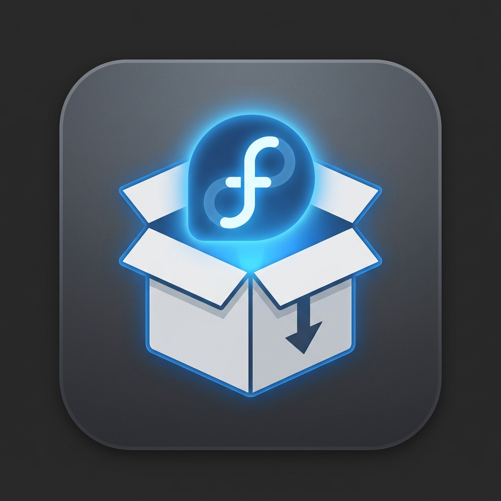

# Fedora Installer


A universal **GUI + CLI** installer for Fedora/GNOME.
Drop any installer file — `.rpm`, `.deb`, `.flatpak`, `.AppImage`, tarball, or `.zip` — and it handles the rest.



### Screenshots

| Install tab | Installed tab |
|---|---|
|  | .png) |

---

## Features

- **One-click installs** — drag & drop or browse from the GTK4 GUI
- **One-click uninstalls** — manage and remove apps from the **Installed** tab
- **Receipt tracking** — every install writes a JSON receipt so removal is clean and complete
- **System-wide search** — find and remove DNF packages, Flatpaks, AppImages, and `/opt/` installs from one place
- **CLI installer** — headless `smart-install.sh` for terminal or scripting
- **Self-updating** — run `fedora-installer --update` to pull the latest release from GitHub
- **Automatic update check** — the GUI quietly checks for new versions on startup and shows a non-blocking banner if one is available
- **Nautilus integration** — right-click any supported file → **Scripts → Smart Install**
- **Desktop notifications** — `notify-send` toast on install complete, failed, or cancelled — you'll know even if you switched windows
- **Last tab memory** — the app reopens on whichever tab (Install or Installed) you used last
- **Auto app-name detection** — strips version suffixes, arch tags, and extensions
- **Desktop entry creation** — installed apps appear in the GNOME launcher automatically
- **Icon extraction** — pulls icons from AppImages, archives, and standard `hicolor`/`pixmaps` paths

---

## Supported Formats

| File type | How it's installed |
|---|---|
| `.rpm` | `dnf install` |
| `.deb` | Converted via `alien` → RPM → `dnf install` |
| `.flatpak` | `flatpak install --user` (user-level, no root needed) |
| `.AppImage` | Copied to `~/.local/bin`, icon extracted, desktop entry created |
| `.tar.gz` / `.tar.xz` / `.tar.bz2` / `.tar.zst` / `.tgz` / `.tar` | Extracted to `/opt/<appname>`, executable symlinked to `/usr/local/bin` |
| `.zip` | Same as tarballs — extracted, symlinked, desktop entry created |

### Smart Archive Handling

For tarballs and zip files, both the GUI and CLI installers automatically:

- **Detect the content root** — handles both single-directory and flat archives
- **Find the main executable** — scores candidates by name match, `/bin/` location, depth, and binary vs. script
- **Skip setup/config scripts** — excludes `install.sh`, `setup.sh`, `uninstall.sh`, `configure`, etc. from executable search
- **Run bundled `install.sh`** if one exists (with return-code checking)
- **Extract icons** — searches for `.png`, `.svg`, `.xpm` with preference for `hicolor`/`pixmaps` paths
- **Create a `.desktop` entry** so the app appears in GNOME's launcher
- **Symlink the executable** to `/usr/local/bin/<appname>` for terminal access
- **Refresh GNOME's icon cache** automatically

---

## Uninstalling / Managing Apps

The GUI includes a dedicated **Installed** tab with two sections:

### Section A — Installed by Fedora Installer

Every successful install (GUI or CLI) writes a JSON receipt to `~/.local/share/fedora-installer/receipts/`. The Installed tab lists these with colored badges (RPM, DEB, Flatpak, AppImage, Tarball, ZIP) and a trash-can button for one-click removal.

| Format | What gets removed |
|---|---|
| RPM / DEB | `dnf remove <package_name>` |
| Flatpak | `flatpak uninstall --user <app_id>` |
| AppImage | Binary in `~/.local/bin/` + icon + `.desktop` entry |
| Tarball / ZIP | `/opt/<appname>/` + `/usr/local/bin/<appname>` symlink + icon + `.desktop` entry |

After successful removal the receipt file is automatically deleted.

### Section B — Search All Installed Apps

A live search box queries across **four sources** simultaneously:

1. **Flatpak** — user and system `flatpak list --app --json`
2. **AppImages** — `~/.local/bin/*.AppImage`
3. **Manual** — directories under `/opt/`
4. **DNF** — `rpm -qa` with summary matching

Results appear grouped by type with individual remove buttons. A confirmation dialog (with an extra "Destructive Action Warning" for `/opt/` directories) precedes every removal. Operations requiring root prompt for a sudo password inline.

> **Note:** Apps not installed via Fedora Installer won't have receipts, so removal is best-effort for AppImage/Manual and clean for DNF/Flatpak.

---

## Install

```bash
git clone https://github.com/kinglukainzy-ai/Fedora-installer-
cd Fedora-installer-
chmod +x setup.sh
./setup.sh
```

The setup script:

1. Installs all system dependencies (`python3-gobject`, `libadwaita`, `gtk4`, `flatpak`, `unzip`, `tar`, `libnotify`)
2. Optionally installs `alien` for `.deb` support
3. Copies `fedora_installer.py` and `VERSION` to `/usr/local/lib/fedora-installer/`
4. Creates a CLI launcher at `/usr/local/bin/fedora-installer` (with built-in `--update` and `--version` flags)
5. Installs `smart-install.sh` to `~/.local/bin/`
6. Registers the `.desktop` entry and app icon
7. Installs the Nautilus right-click script

---

## Usage

### GUI

```bash
fedora-installer
# or open directly with a file:
fedora-installer ~/Downloads/someapp.tar.gz
```

1. Open the app — drag a file onto the window or click **Browse**
2. Optionally override the app name
3. Enter your sudo password if the install requires root (e.g. RPM, tarball → `/opt/`)
4. Hit **Install**

> **Note:** The sudo password field pipes to `sudo -S` and is only needed for operations that require root access (RPM/deb install, writing to `/opt/`, symlinking to `/usr/local/bin/`). AppImage and Flatpak installs are user-level and don't need it.

On launch the GUI performs a **background version check** against the GitHub repo. If a newer version exists, a subtle banner appears at the top of the window with a "How to update" button — it never blocks you from using the app.

### CLI

```bash
smart-install.sh ~/Downloads/someapp.tar.gz
smart-install.sh ~/Downloads/thing.AppImage myapp   # override app name
```

Desktop notifications are sent on success or failure. The script uses `set -euo pipefail` and an `EXIT` trap to guarantee cleanup of temp directories and send failure notifications if anything goes wrong.

### Right-Click in Files (Nautilus)

Right-click any supported file → **Scripts** → **Smart Install**

A Zenity dialog prompts for an optional app name override, then runs the installer in a `gnome-terminal` window so you can watch the output.

---

## Updating

Fedora Installer includes a built-in self-update mechanism so you always have the latest fixes and features.

### Check your current version

```bash
fedora-installer --version
```

### Update to the latest release

```bash
fedora-installer --update
```

This will:

1. Fetch the latest `VERSION` from GitHub
2. Compare it to your locally installed version
3. If newer: `git clone --depth=1` the repo into a temp directory and re-run `setup.sh`
4. Clean up the temp directory automatically (even on failure, via an `EXIT` trap)

If you're already up to date, it prints `✅ Already up to date` and exits.

> **Tip:** The GUI also checks automatically on startup. If an update is available, a non-intrusive banner appears at the top of the window — click "How to update" for instructions.

---

## Security

- **No shell injection** — all `subprocess` calls in the GUI use argument lists, never `bash -c` with interpolated strings
- **Safe positional arguments** — the Nautilus script passes variables as positional args to `bash -c`, immune to single-quote injection
- **App name sanitization** — whitespace in app names is normalized to hyphens, preventing broken paths in `/opt/` and `/usr/local/bin/`
- **Temp directory isolation** — all archive extraction and `.deb` conversion happens in `mktemp -d` (CLI) or `tempfile.TemporaryDirectory()` (GUI), never polluting the working directory
- **Return-code checking** — all critical subprocess calls check exit codes and report failures
- **Cleanup on failure** — the CLI script's `EXIT` trap removes temp directories even on unexpected exits

---

## Requirements

- **Fedora 38+** with GNOME
- **Python 3.11+**, GTK4, libadwaita, `python3-gobject`
- `alien` — optional, for `.deb` → `.rpm` conversion
- `zenity` — for the Nautilus right-click dialog
- `gnome-terminal` — for terminal output during Nautilus installs (falls back to inline execution)

The setup script (`setup.sh`) installs all of these automatically.

---

## Project Structure

```
├── fedora_installer.py                                 # GTK4/Adw GUI application
├── smart-install.sh                                    # CLI installer (no GUI needed)
├── Smart Install                                       # Nautilus right-click script
├── setup.sh                                            # One-time setup / dependency installer
├── install.sh                                          # Symbolic link to setup.sh (convenience entry point)
├── VERSION                                             # Semver string (e.g. 1.0.0) used by --update
├── io.github.kinglukainzy_ai.FedoraInstaller.desktop   # .desktop file with MIME types
├── fedora-installer.png                                # App icon
├── LICENSE                                             # GPL-3.0 license
└── README.md
```

---

## Contributing

Issues and pull requests are welcome.
Please open an issue first for major changes.

---

## Acknowledgements

Built with [GTK4](https://gtk.org/) and [libadwaita](https://gnome.pages.gitlab.gnome.org/libadwaita/).
Inspired by the lack of a universal installer on Fedora Linux.

---

## License

This project is licensed under the **GNU General Public License v3.0** — see the [LICENSE](LICENSE) file for details.

---

## Changelog

### v1.2.0 (2026-06-10)

- **Notification on install complete** — a `notify-send` toast fires when an installation finishes (success, failure, or cancellation), so you know it's done even if you switched windows.
- **Remember last tab** — the app reopens on whichever tab (Install or Installed) you used last. The preference is stored in `~/.config/fedora-installer/config.json`.

### v1.1.0

- Cancel button for in-progress installs with partial-file cleanup
- System-wide search across DNF, Flatpak, AppImages, and `/opt/`
- Uninstall support with JSON receipt tracking
- Preferences window for `.deb` install method
- First-launch dialog
- `/var/tmp` extraction to avoid RAM-limited tmpfs
- Pre-flight disk space check

### v1.0.0

- Initial release — GUI + CLI installer for `.rpm`, `.deb`, `.flatpak`, `.AppImage`, tarball, and `.zip`
